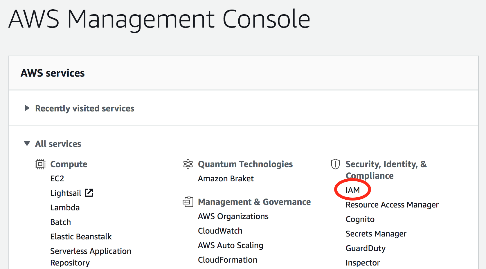
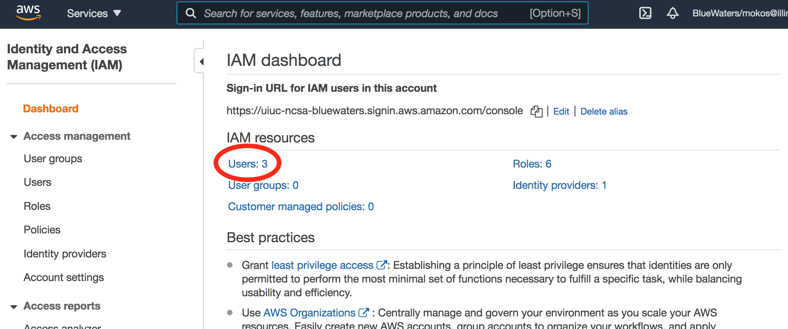
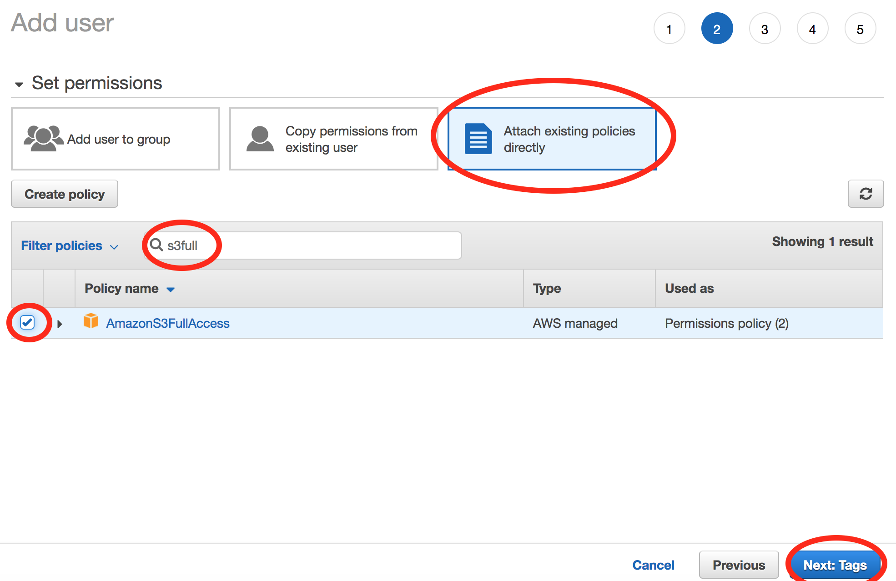

=====================================================================
Using AWS (Amazon Web Services) S3 CLI with Boto3 Python Package
=====================================================================

This page steps one through the process of setting up an AWS account and
using the Boto3 python package to access S3 buckets via the CLI (command
line interface).

For those at the University of Illinois, here are a couple useful links:

| Log in to Illinois AWS account:
  `https://aws.illinois.edu <https://aws.illinois.edu/>`__
| Illinois AWS resources (Tech Services page):
  https://answers.uillinois.edu/illinois/search.php?q=AWS

**Important note: you will need access to the**\ `Hydro
cluster <https://bluewaters.ncsa.illinois.edu/hydro>`__\ **to use Boto3.
There are issues with installing it on Blue Waters.**

Obtain AWS Account
==================

First, of course, you need access to an AWS account. If you reside at
the University of Illinois, instructions for requesting an Illinois AWS
account can be found here: https://answers.uillinois.edu/illinois/63359
Otherwise, consult the IT/network team (and/or your supervisor) at your
institution for details on obtaining an account.

Create Access Keys
==================

This is done by an account admin through the AWS IAM (Identity and
Access Management) console.

Instructions can be found here:
https://docs.aws.amazon.com/IAM/latest/UserGuide/id_credentials_access-keys.html#Using_CreateAccessKey

If you were given an admin account on AWS, follow the steps below to
create a user with access keys. Only user instances can have keys, so
even if you have an admin account, you still need to create a user
instance for yourself. If you don't have an admin account, find out who
does at your institution and ask them to create a user with access keys
for you.

After logging in (use
`https://aws.illinois.edu <https://aws.illinois.edu/>`__ if you're at U
of I), go to the IAM Dashboard:

Under "IAM resources," click Users:

Select "Add users":

.. image:: boto_step3.png

Choose a user name and set access type to "Programmatic access"; click
"Next: Permissions":

.. image:: boto_step4.png

On the "Set permissions" screen, select "Attach existing policies
directly" and choose "AmazonS3FullAccess"; click "Next: Tags":

On the next screen, there's no need to do anything with tags, so just
click "Next: Review."

There's also nothing you need to do on the Review screen, so just click
"Create user."

At the end of the user creation process, it gives you an "Access key ID"
and "Secret access key"; save these:

.. image:: boto_step6.png

If you have an admin account, you can also create user instances for
other group members who need access.

Store Access Keys on System
===========================

To allow CLI access to AWS, the keys need to be stored in a credentials
file:

+-----------------------------------------------------------------------+
| ::                                                                    |
|                                                                       |
|    mkdir -p ~/.aws                                                    |
|    vim ~/.aws/credentials                                             |
+-----------------------------------------------------------------------+

The file should have these three lines:

+-----------------------------------------------------------------------+
| ::                                                                    |
|                                                                       |
|    [default]                                                          |
|    aws_access_key_id = <YOUR_ACCESS_KEY>                              |
|    aws_secret_access_key = <YOUR_SECRET_KEY>                          |
+-----------------------------------------------------------------------+

Install Boto3
=============

Instructions can be found here:
https://boto3.amazonaws.com/v1/documentation/api/latest/guide/quickstart.html

The procedure for installing boto3 in a virtual environment on the Hydro
cluster (https://bluewaters.ncsa.illinois.edu/hydro) is simple:

+-----------------------------------------------------------------------+
| ::                                                                    |
|                                                                       |
|    # with module Python/3.8.6-GCCcore-10.2.0 loaded                   |
|    # cd to location where you want to create the virtual environment  |
|    mkdir myvirtualenv                                                 |
|    cd myvirtualenv                                                    |
|    virtualenv --system-site-packages $PWD                             |
|    source bin/activate                                                |
|    pip install boto3                                                  |
+-----------------------------------------------------------------------+

This should work without issue.

AWS S3 Bucket Interaction Examples
==================================

If boto3 is installed in a virtual environment, you need to be in the
virtual environment (i.e., it needs to be activated) to use it:

+-----------------------------------------------------------------------+
| ::                                                                    |
|                                                                       |
|    source myvirtualenv/bin/activate                                   |
+-----------------------------------------------------------------------+

Here are some example python scripts for interacting with AWS:

**bucket_list.py - list all buckets**
-------------------------------------

Usage: ./bucket_list.py

+-----------------------------------------------------------------------+
| ::                                                                    |
|                                                                       |
|    #!/usr/bin/env python                                              |
|                                                                       |
|    # from https://                                                    |
| boto3.amazonaws.com/v1/documentation/api/latest/guide/quickstart.html |
|                                                                       |
|    import boto3                                                       |
|                                                                       |
|    # Let's use Amazon S3                                              |
|    s3 = boto3.resource('s3')                                          |
|                                                                       |
|    # Print out bucket names                                           |
|    for bucket in s3.buckets.all():                                    |
|        print(bucket.name)                                             |
+-----------------------------------------------------------------------+

**upload_file.py - upload a file to a bucket**
----------------------------------------------

| Usage: ./upload_file file_name [bucket_name]
| Be sure to set default_bucket in the script to the name of the bucket
  that you want to be your default.

+-----------------------------------------------------------------------+
| ::                                                                    |
|                                                                       |
|    #!/usr/bin/env python                                              |
|                                                                       |
|    # Usage: ./upload_file file_name [bucket_name]                     |
|                                                                       |
|    # from https://boto3.am                                            |
| azonaws.com/v1/documentation/api/latest/guide/s3-uploading-files.html |
|                                                                       |
|    default_bucket = 'uiuc-ncsa-bluewaters-rmokos-test'                |
|                                                                       |
|    import sys                                                         |
|    import logging                                                     |
|    import boto3                                                       |
|    from botocore.exceptions import ClientError                        |
|                                                                       |
|    def upload_file(file_name, bucket, object_name=None):              |
|        """                                                            |
|        Upload a file to an S3 bucket                                  |
|                                                                       |
|        :param file_name: File to upload                               |
|        :param bucket: Bucket to upload to                             |
|        :param                                                         |
|  object_name: S3 object name. If not specified then file_name is used |
|        :return: True if file was uploaded, else False                 |
|        """                                                            |
|                                                                       |
|        # If S3 object_name was not specified, use file_name           |
|                                                                       |
|        if object_name is None:                                        |
|            object_name = file_name                                    |
|                                                                       |
|        # Upload the file                                              |
|        s3_client = boto3.client('s3')                                 |
|        try:                                                           |
|                                                                       |
|      response = s3_client.upload_file(file_name, bucket, object_name) |
|        except ClientError as e:                                       |
|            logging.error(e)                                           |
|            return False                                               |
|        return True                                                    |
|                                                                       |
|    try:                                                               |
|        bname = sys.argv[2]                                            |
|    except IndexError:                                                 |
|        bname = default_bucket                                         |
|                                                                       |
|    upload_file(sys.argv[1], bname)                                    |
+-----------------------------------------------------------------------+

**download_file.py - download a file from a bucket**
----------------------------------------------------

| Usage: ./download_file file_name [bucket_name]
| Be sure to set default_bucket in the script to the name of the bucket
  that you want to be your default.

+-----------------------------------------------------------------------+
| ::                                                                    |
|                                                                       |
|    #!/usr/bin/env python                                              |
|                                                                       |
|    # Usage: ./download_file file_name [bucket_name]                   |
|                                                                       |
|    # from https://boto3.amazonaw                                      |
| s.com/v1/documentation/api/latest/guide/s3-example-download-file.html |
|                                                                       |
|    default_bucket = 'uiuc-ncsa-bluewaters-rmokos-test'                |
|                                                                       |
|    import sys                                                         |
|    import logging                                                     |
|    import boto3                                                       |
|    from botocore.exceptions import ClientError                        |
|                                                                       |
|    def download_file(file_name, bucket, dest_file_name):              |
|        """                                                            |
|        Download a file from an S3 bucket                              |
|                                                                       |
|        :param file_name: File to download (S3 object name)            |
|                                                                       |
|        :param bucket: Bucket to download from                         |
|        :param dest_file_name: Name to                                 |
| use for the downloaded file. If not specified, then file_name is used |
|        :return: True if file was downloaded, else False               |
|        """                                                            |
|                                                                       |
|        # If dest_file_name was not specified, use file_name           |
|        if dest_file_name is None:                                     |
|            dest_file_name = file_name                                 |
|                                                                       |
|        # Download the file                                            |
|        s3_client = boto3.client('s3')                                 |
|        try:                                                           |
|                                                                       |
| response = s3_client.download_file(bucket, file_name, dest_file_name) |
|        except ClientError as e:                                       |
|            logging.error(e)                                           |
|            return False                                               |
|        return True                                                    |
|                                                                       |
|    try:                                                               |
|        bname = sys.argv[2]                                            |
|    except IndexError:                                                 |
|        bname = default_bucket                                         |
|                                                                       |
|    download_file(sys.argv[1], bname, sys.argv[1])                     |
+-----------------------------------------------------------------------+

Hydro <=> AWS Transfer Rates
============================

The measured time for uploading a tiny file (a few bytes) using "time
-p" on the python script was 0.78 sec, and the same for downloading was
0.86 sec. Considering these to be "overhead" times, they were subtracted
from the measured times for 1-MB and 10-GB transfers to get the times
and transfer rates below. Note that the 1-MB file was 2^20 bytes, and
the 10-GB file was 10*2^30 bytes. More tests were not performed due to
cost concerns (Amazon charges based on the amount of data transferred).

Upload from Hydro to AWS
~~~~~~~~~~~~~~~~~~~~~~~~

========= ========== =============
File Size Time (sec) Transfer Rate
1 MB      0.17       5.9 MB/sec
10 GB     51.89      197.3 MB/sec
========= ========== =============

Download from AWS to Hydro
~~~~~~~~~~~~~~~~~~~~~~~~~~

========= ========== =============
File Size Time (sec) Transfer Rate
1 MB      0.12       8.3 MB/sec
10 GB     34.43      297.4 MB/sec
========= ========== =============
